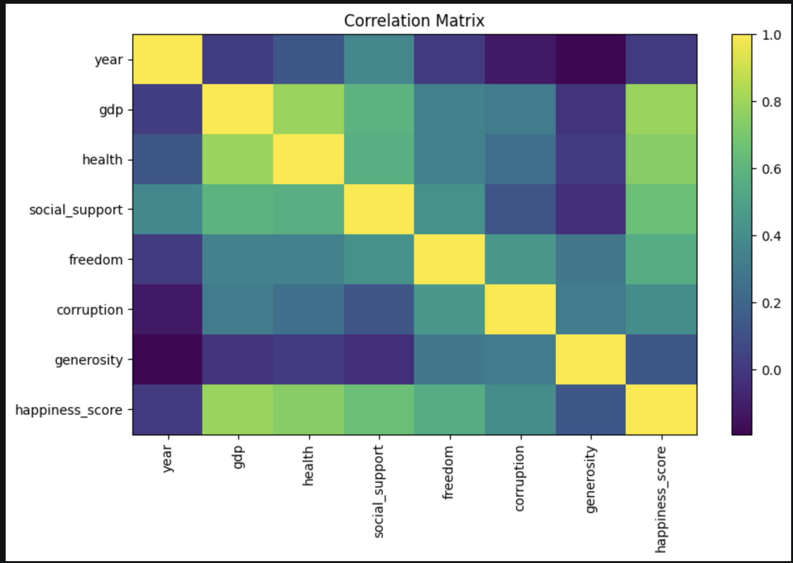
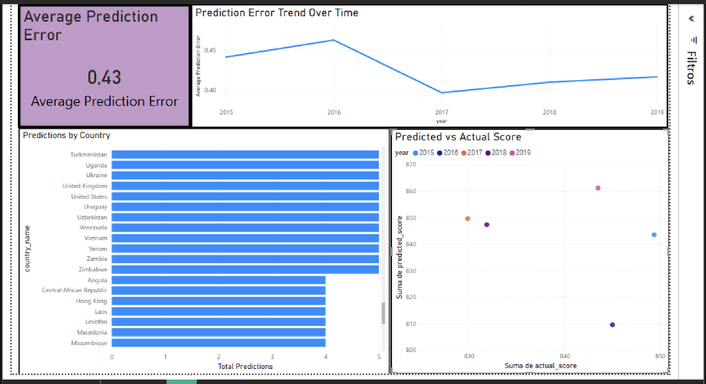

# ETL Workshop 3

This repository contains the development of Workshop 3 for the ETL course, created by Valentina Morales.

The objective of this project is to build an integrated ETL and streaming pipeline using historical World Happiness datasets from 2015 to 2019. The project includes data profiling, data cleaning, schema harmonization, feature engineering, machine learning model training, Kafka-based streaming inference, prediction storage in a MySQL data warehouse, and a Power BI dashboard.

---

Before starting, you must first install the different dependencies that will be used; these are located in: `requirements.txt`

---

## 1. Exploratory Data Analysis

An exploratory data analysis was performed for each dataset from 2015 to 2019. The analysis included the review of dataset structure, missing values, duplicated records, inconsistent column names, data types, possible outliers, and schema differences between years.

### 2015 Dataset

For the 2015 dataset, no missing values or duplicated records were identified. No country or region names appeared to be written inconsistently. Some names were similar, but they represented different countries. No significant outliers were found. Some values equal to zero were identified, but these were not considered errors because the variables represent contributions to the happiness score. A value of zero may indicate that the indicator did not contribute to the score for that specific record.

### 2016 Dataset

For the 2016 dataset, no missing values or duplicated records were identified. No inconsistencies were found in country or region names. Similar names were reviewed, but they represented different countries. No significant outliers were found. As in the previous dataset, values equal to zero were interpreted as valid because they may represent no contribution of that indicator to the happiness score.

### 2017 Dataset

For the 2017 dataset, no missing values or duplicated records were identified. No country names were found to be written inconsistently. Some similar names were reviewed, but they represented different countries. No significant outliers were found. Values equal to zero were considered valid because these variables represent contributions to the happiness score.

### 2018 Dataset

For the 2018 dataset, one missing value was identified in the `Perceptions of corruption` column. No duplicated records were found. The `Country or region` column was compared with the regions from previous years, and it was concluded that the values corresponded to countries rather than regions. No inconsistent country names were identified. Some similar names were reviewed, but they represented different countries. No significant outliers were found. Values equal to zero were considered valid because they may indicate that the indicator did not contribute to the happiness score.

### 2019 Dataset

For the 2019 dataset, no missing values or duplicated records were identified. The `Country or region` column was also reviewed and compared with previous regional categories. It was concluded that the values corresponded to countries. No inconsistencies in country names were identified. Some similar names were reviewed, but they represented different countries. No significant outliers were found. Values equal to zero were considered valid because they may represent no contribution to the happiness score.

## 2. Schema Differences Between Years

The datasets do not share exactly the same schema. The 2015 and 2016 datasets are very similar, although 2015 includes `Standard Error`, while 2016 includes `Lower Confidence Interval` and `Upper Confidence Interval`.

The 2017 dataset contains similar variables, but most column names are written differently compared to previous years. The 2018 and 2019 datasets have the same column structure and the same column names.

Because of these schema differences, it was necessary to analyze and harmonize the datasets before merging them into a unified analytical dataset.

## 3. Unified Schema Proposal

To merge the datasets, key columns were identified and standardized based on their meaning across the different years. The following decisions were made:

1. A `year` column was created to identify the source year of each record.

2. The country column was standardized as `country`.  
   The original columns were:
   - `Country`
   - `Country or region`

3. The ranking column was standardized as `happiness_rank`.  
   The original columns were:
   - `Happiness Rank`
   - `Happiness.Rank`
   - `Overall rank`

4. The happiness score column was standardized as `happiness_score`.  
   The original columns were:
   - `Happiness Score`
   - `Happiness.Score`
   - `Score`

5. The GDP column was standardized as `gdp`.  
   The original columns were:
   - `Economy (GDP per Capita)`
   - `Economy..GDP.per.Capita.`
   - `GDP per capita`

6. The social support column was standardized as `social_support`.  
   The original columns were:
   - `Family`
   - `Social support`

7. The health column was standardized as `health`.  
   The original columns were:
   - `Health (Life Expectancy)`
   - `Health..Life.Expectancy.`
   - `Healthy life expectancy`

8. The freedom column was standardized as `freedom`.  
   The original columns were:
   - `Freedom`
   - `Freedom to make life choices`

9. The corruption perception column was standardized as `corruption`.  
   The original columns were:
   - `Trust (Government Corruption)`
   - `Trust..Government.Corruption.`
   - `Perceptions of corruption`

10. The generosity column was standardized as `generosity`, since all datasets used the same column name:
   - `Generosity`

## Data Cleaning and Harmonization

### Unified Schema Proposal

To integrate the datasets from 2015 to 2019, a unified schema was defined. Since the datasets had different column names depending on the year, equivalent columns were identified and renamed using a common final name.

| Final name | 2015 | 2016 | 2017 | 2018 | 2019 |
|---|---|---|---|---|---|
| year | Created column | Created column | Created column | Created column | Created column |
| country | Country | Country | Country | Country or region | Country or region |
| happiness_rank | Happiness Rank | Happiness Rank | Happiness.Rank | Overall rank | Overall rank |
| happiness_score | Happiness Score | Happiness Score | Happiness.Score | Score | Score |
| gdp | Economy (GDP per Capita) | Economy (GDP per Capita) | Economy..GDP.per.Capita. | GDP per capita | GDP per capita |
| social_support | Family | Family | Family | Social support | Social support |
| health | Health (Life Expectancy) | Health (Life Expectancy) | Health..Life.Expectancy. | Healthy life expectancy | Healthy life expectancy |
| freedom | Freedom | Freedom | Freedom | Freedom to make life choices | Freedom to make life choices |
| corruption | Trust (Government Corruption) | Trust (Government Corruption) | Trust..Government.Corruption. | Perceptions of corruption | Perceptions of corruption |
| generosity | Generosity | Generosity | Generosity | Generosity | Generosity |

### Cleaning Rules

| Problem found | Column | Cleaning rule | Action if it fails |
|---|---|---|---|
| Missing values | Perceptions of corruption | There must be no missing values in the selected model features | Discard the row |
| Different column names | All datasets | Columns with the same meaning were renamed to a unified schema | Rename columns before merging |
| Missing year column | All datasets | A `year` column must be created from the source file year | Add the year before merging |
| Non-selected columns | Columns not shared across all years | Columns that were not consistent across all datasets were not included in the unified dataset | Exclude from the final merge |
| Zero values | Numeric contribution columns | Zero values were not automatically treated as errors because they may represent no contribution to the happiness score | Keep the value if it is contextually valid |

### Justification of Cleaning Decisions

Rows with missing values were discarded because the number of affected records was very small and removing them was not expected to significantly alter the results. In this case, the only relevant missing value was found in the `Perceptions of corruption` column.

Column names were normalized by defining a general name for each equivalent variable across the different years. Although many columns represented the same concept, their names varied between datasets. For example, the happiness score, GDP, health, freedom, and corruption variables had different names depending on the year.

The `year` column was created because it did not exist in the original datasets. This column is necessary to identify the year associated with each record after merging all datasets.

Some columns were not included in the final unified dataset because they were not present in all years or were not relevant for the machine learning model. Additionally, zero values were not considered inconsistencies because, based on the context of the dataset, they may represent the absence of contribution of that variable to the happiness score rather than an error.

## 4. Data Cleaning Decisions

The main cleaning decision was to standardize column names across all datasets to create a unified analytical schema. Numeric columns were converted to numeric data types, and the `year` column was added to preserve the temporal origin of each record.

The missing value found in the 2018 `Perceptions of corruption` column was handled during the cleaning process. Values equal to zero were not automatically removed because they may represent valid cases where a specific indicator did not contribute to the happiness score.

## 5. Initial Conclusion

The exploratory analysis showed that the main challenge was not the presence of duplicated records or severe missing values, but the inconsistency in column names and schema structure across the datasets. Therefore, schema harmonization was required before integrating the data and preparing it for machine learning.

---

## Feature Engineering

### Feature Selection and Data Preparation for the Machine Learning Model

Before starting this process, the auxiliary files `cleaning.py` were created, which will perform the entire cleaning and normalization process mentioned, and `union.py`, which will perform the union of all the datasets.

For the machine learning model, the target variable was defined as:

- `happiness_score`

Initially, the following numerical variables were analyzed as possible predictors:

- `year`
- `gdp`
- `health`
- `social_support`
- `freedom`
- `corruption`
- `generosity`

However, after analyzing the correlation results and the behavior of the variables, the final selected features were:

- `gdp`
- `health`
- `social_support`
- `freedom`
- `corruption`
- `generosity`

The variable `happiness_rank` was excluded to avoid target leakage. This variable directly represents the ranking position of each country according to the happiness score, so including it would give the model information that is too closely related to the target variable.

The variable `year` was analyzed but was not included in the final model because its correlation with `happiness_score` was almost zero. Therefore, it did not provide relevant predictive information for the model.

### Correlation Analysis

The correlation analysis showed that the variables most strongly related to `happiness_score` were:

- `gdp`
- `health`
- `social_support`
- `freedom`
- `corruption`

The variables with the lowest correlation were:

- `generosity`
- `year`

The correlation matrix confirmed these results. Variables with stronger relationships to `happiness_score` showed higher correlation values, while variables such as `year` and `generosity` showed weaker relationships. The matrix also allowed the identification of relationships between the predictor variables themselves.

### Graphical Analysis

Several visual analyses were performed to understand the relationship between each feature and the target variable.

1. A positive relationship was observed between `gdp` and `happiness_score`. This indicates that countries with higher economic contribution tend to have higher happiness scores.

2. A positive relationship was observed between `health` and `happiness_score`. This suggests that countries with higher healthy life expectancy tend to report higher happiness scores.

3. A positive relationship was observed between `social_support` and `happiness_score`. Countries with stronger social support tend to have higher happiness scores.

4. A moderate positive relationship was observed between `freedom` and `happiness_score`. Although the data points show some dispersion, countries with higher freedom values tend to report higher happiness scores.

5. The variable `corruption` represents an indicator related to corruption perception or institutional trust. In this dataset, higher values are interpreted as a better institutional perception, not as higher corruption. A weak to moderate positive relationship was observed between `corruption` and `happiness_score`. Although the data points are highly dispersed, especially at lower values, the correlation shows that this variable still contributes useful information to the model.

6. A low to moderate positive relationship was observed between `generosity` and `happiness_score`. The data points show dispersion, and many high happiness scores are associated with relatively low generosity values. However, the relationship is not completely null, so the variable was kept in the model.

7. The variable `year` did not show a relevant relationship with `happiness_score`. Since its correlation was almost zero, it was discarded from the final model.

## Train Regression Model

### Model Training, Evaluation and Serialization

A Linear Regression model was used for training because it is a simple and interpretable model, suitable for predicting a continuous numerical variable such as `happiness_score`.

A `StandardScaler` was included inside a pipeline to standardize the predictor variables before training the model. This ensures that all numerical features are on a comparable scale.

The dataset was split into training and testing sets using a 70/30 split. The model was then trained and evaluated using the following metrics:

| Metric | Result |
|---|---:|
| MAE | 0.4321 |
| RMSE | 0.5566 |
| R² | 0.7519 |

The Mean Absolute Error (MAE) was 0.4321, which means that, on average, the model prediction differs from the real happiness score by approximately 0.43 points.

The Root Mean Squared Error (RMSE) was 0.5566, which indicates that the model has a relatively low prediction error.

The R² value was 0.7519, meaning that the model explains approximately 75.19% of the variability in the happiness score. This result is acceptable for the purpose of this workshop, since the main objective is to integrate a complete ETL, Kafka, machine learning, database, and dashboard pipeline rather than optimizing the model performance.

Finally, the trained model and the feature list were serialized and saved for later use in the streaming pipeline:

- `models/model.pkl`
- `models/features.pkl`

Overall, the model showed acceptable performance for the workshop's objective, and the serialized model can be integrated into the Kafka consumer to perform real-time inferences.

---

## Kafka Streaming Pipeline

After completing the first part of the project, Part B was developed, which corresponds to the **Streaming ETL with Apache Kafka** process.

To start this stage, the **Kafka** and **Zookeeper** containers were created and started using Docker Compose with the following command:

`docker compose up -d`

---

This enabled communication between the Kafka producer and consumer.

In this process, the producer reads the raw .csv files from 2015 to 2019. Unlike the first part of the project, this stage does not use a previously merged dataset. Instead, the producer reads each file and streams the records one by one as JSON events to the Kafka topic happiness-predictions.

Although the data comes from raw files, the producer standardizes the column names before sending each event, using the same schema defined during the data cleaning stage. This allows the consumer to receive and process the events consistently.

The consumer performs a more extensive process because it is responsible for several tasks within the pipeline. To improve code organization, some functions were separated into auxiliary files and then imported into consumer.py.

The consumer receives events in real time from Kafka and, as the first step, stores the original message in the raw_happiness_events table before applying any validation or prediction. This ensures traceability of the received data.

After storing the raw event, the consumer validates the JSON event schema by checking for missing fields, invalid data types, and invalid numerical values. Then, it ensures that the predictor variables follow the same order used during model training, loads the serialized model from model.pkl, generates the happiness_score prediction, and stores the results in the database.

For this process, a MySQL database called happiness_dw was created. This database works as the project data warehouse and contains several tables, each one with a specific purpose.

- The raw_happiness_events table stores the original event received from Kafka, along with its processing status and possible error messages.

- The dim_country table stores the unique countries.

- The dim_date table stores the years present in the data.

- The dim_raw_event table stores additional information about the raw event, such as processing status, ingestion time, event source, and Kafka topic name.

- The fact_predictions table works as the fact table and stores the prediction results, including the actual score, predicted score, prediction error, event timestamp, and prediction timestamp.

Each prediction is linked to the original event using raw_event_id, which allows every result to be traced back to the exact Kafka message that generated it.

The following diagram represents the data warehouse schema used in the project:

---

## Execution Instructions

To run the project, the Kafka and Zookeeper containers must first be started using Docker Compose:

`docker compose up -d`
Then, the MySQL database and its tables must be created by running the SQL script or the create_tables.py file, depending on the project configuration.

The files validation.py, model_utils.py, database.py, and config.py are auxiliary files. They are not executed directly because they are imported by consumer.py to validate events, load the serialized model, connect to the database, and manage general configuration settings.

After that, the consumer must be executed inside the kafka folder:

`python consumer.py`

Finally, in another terminal, the producer must be executed inside the kafka folder:

`python producer.py`

---

## Dashboard Explanation

The final dashboard was built in Power BI using a Windows virtual machine in UTM. The dashboard is connected directly to the MySQL data warehouse, not to CSV files.

The dashboard includes the following required KPIs:

1. Average prediction error
2. Predictions by country
3. Predicted vs actual score
4. Prediction trends over time

The average prediction error shows that the model has a relatively low prediction error, which indicates that the predictions are generally effective for the purpose of this workshop.

The predictions by country visualization shows that most countries have five predictions because they appear in the happiness rankings from 2015 to 2019. However, some countries appear fewer times because they are not present in all yearly datasets.

The prediction trend over time shows that the prediction error remains at relatively low levels across the years. The highest error peak appears in 2016, where the model performance was slightly less accurate compared to the other years.

Finally, the predicted vs actual score visualization shows that the predicted values are generally close to the real happiness scores. This confirms that the model predictions do not present major differences compared to the actual values, although some variation is visible, especially in 2016.

